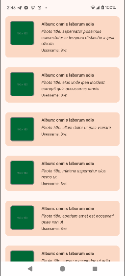

# Samsung Album Showcase  

[](https://opensource.org/licenses/Apache-2.0)
[](https://developer.android.com/studio)
[](https://kotlinlang.org/)  

A clean and responsive Android application for showcasing albums and photos. Built using modern Android development practices, including MVVM architecture, Jetpack Compose, Hilt, Service, Coroutines, Flow and Retrofit.

---

## Table of Contents

- [Screenshots](#screenshots)
- [Tech Stack](#tech-stack)
- [Architecture](#architecture)
- [Project Structure](#project-structure)  
- [Installation](#installation)  
- [Testing](#testing)  
- [Contributing](#contributing)  
- [License](#license)
- [Contact](#contact)

---

## 📸 Screenshots  

### Home Screen



## Tech Stack

- **Programming Language:** Kotlin
- **UI Framework:** Jetpack Compose
- **Architecture:** MVVM + Clean Architecture
- **Dependency Injection:** Hilt
- **Networking:** Retrofit & OkHttp
- **Asynchronous Tasks:** Kotlin Coroutines & Flow
- **Background task:** Service

## Architecture

This project follows **MVVM (Model-View-ViewModel)** architecture to ensure a clean separation of concerns:

1. **Model**:  
   - Responsible for handling data operations like network calls or database queries.  
   - Example: `Repository` classes.

1. **Domain**:
   - Defines Models and Data repositories  
   - Responsible for handling business logic and use cases.    

2. **ViewModel**:  
   - Acts as a bridge between the `Model` and `View`.  
   - Manages UI-related data and state.  

3. **View**:  
   - Implements the user interface via **Jetpack Compose**.  
   - Observes data changes from the `ViewModel` and renders the UI.

## Project Structure

```plaintext
├── data/                           # Data layer: API, database, repositories  
│   ├── api/                        # Retrofit interfaces and network models    
│   └── repository/                 # Repository implementations 
├── di/                             # Dependency injection modules 
├── domain/                         # Domain layer: Business logic and use cases  
│   ├── entities/                   # Core domain models
│   ├── repositories/               # Repository Interfaces  
│   └── usecase/                    # Use cases for app features  
├── service/                        # Android services for background tasks
├── ui/                             # Presentation layer: UI and ViewModel  
│   ├── features/                           
│   └── theme/                        
├── build.gradle                    # Gradle configuration  
└── AndroidManifest.xml             # App configuration  
```

- **domain:** Contains core business logic, entities, and use cases.
- **data:** Manages API calls, data caching, and data mapping.
- **presentation:** Handles UI and interaction logic.
- **di:** Dependency injection setup using Hilt.
- **services**: Service is used for background tasks, which is used as a **"Bound Service"** to communicate with UI

## Installation

1. Clone the repository:
   ```bash
   git clone https://github.com/HasibPrince/Samsung-Album-Showcase.git
   ```

2. Open the project in Android Studio.

3. Sync the project with Gradle files.

4. Build and run the app on an emulator or physical device.

## Testing

- **Unit Tests:** Run unit tests located in the `src/test` directory.
- **Instrumentation Tests:** Execute tests in the `src/androidTest` directory.

Run tests using the following command:

```bash
./gradlew testDebugUnitTest
./gradlew connectedDebugAndroidTest
```

## Contributions

Contributions are welcome! Please follow these steps:

1. Fork the repository.
2. Create a new branch (`feature/your-feature`).
3. Commit your changes.
4. Push to your branch.
5. Open a pull request.

## License

Copyright 2024 HasibPrince (Md. Hasibun Nayem)

Licensed under the Apache License, Version 2.0 (the "License");
you may not use this file except in compliance with the License.
You may obtain a copy of the License at

    http://www.apache.org/licenses/LICENSE-2.0

Unless required by applicable law or agreed to in writing, software
distributed under the License is distributed on an "AS IS" BASIS,
WITHOUT WARRANTIES OR CONDITIONS OF ANY KIND, either express or implied.
See the License for the specific language governing permissions and
limitations under the License.

## Contact

For questions or feedback, feel free to reach out:

- **Author:** Hasib Prince
- **GitHub:** [HasibPrince](https://github.com/HasibPrince)

---

Thank you for checking out the Samsung Album Showcase project! ✨

